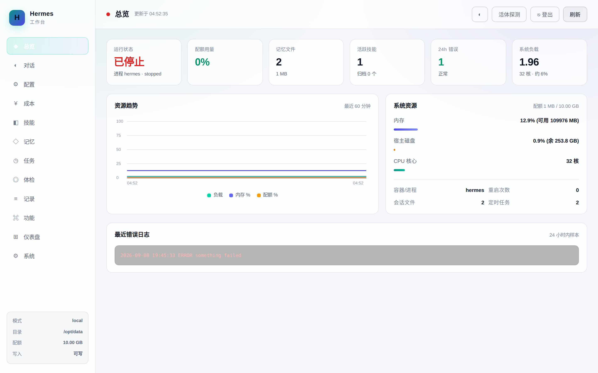
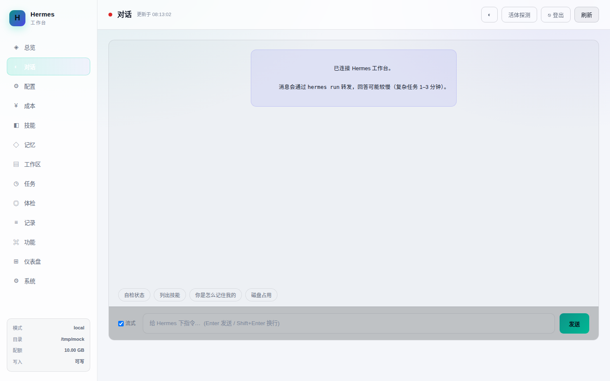
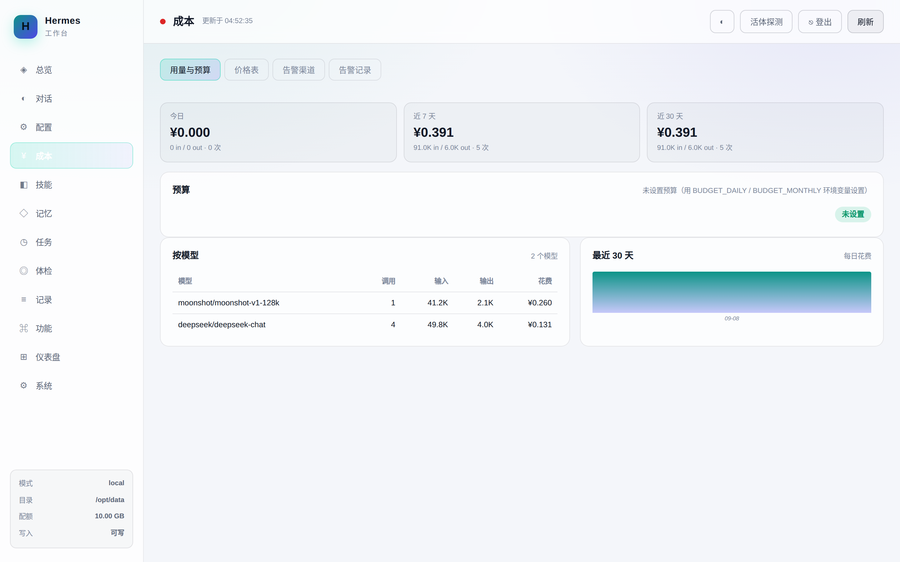
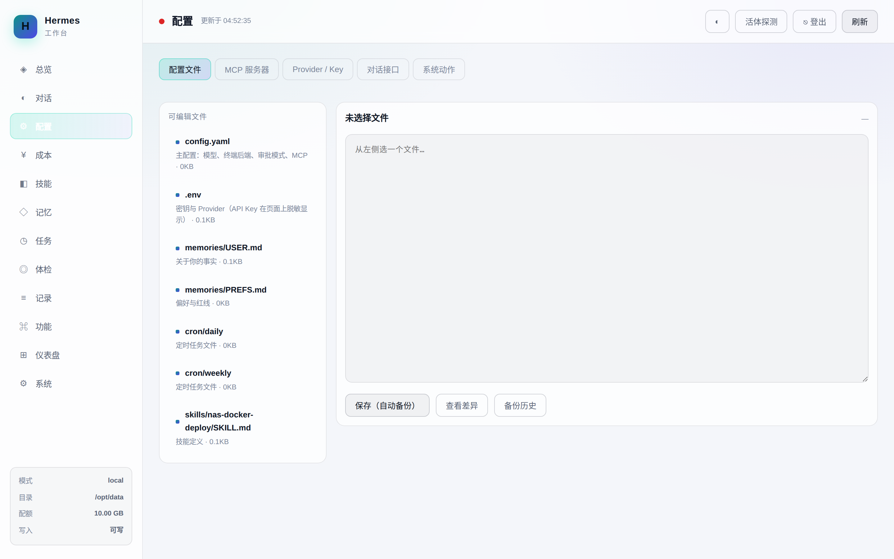
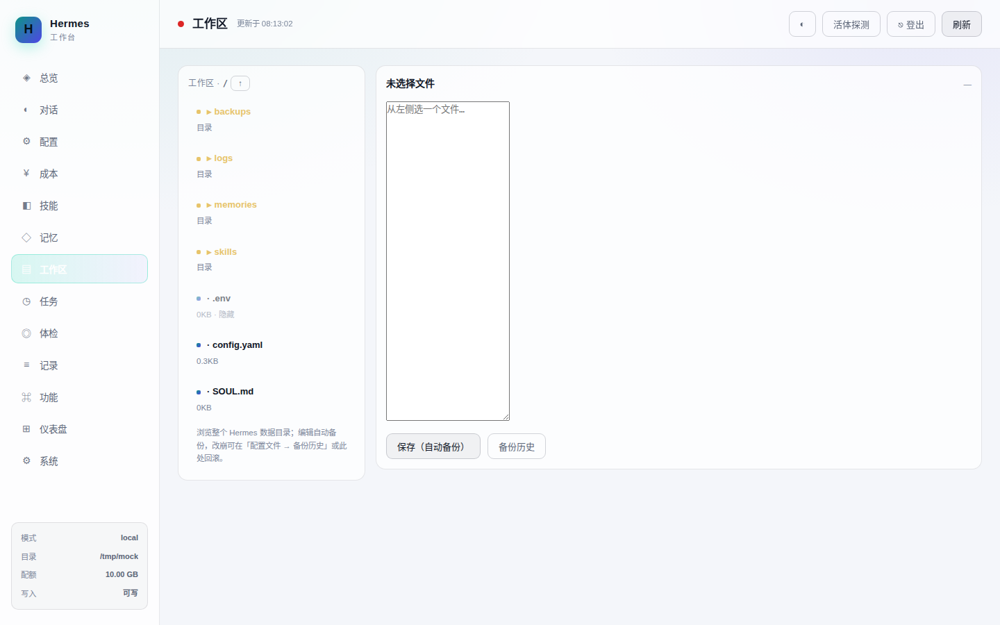
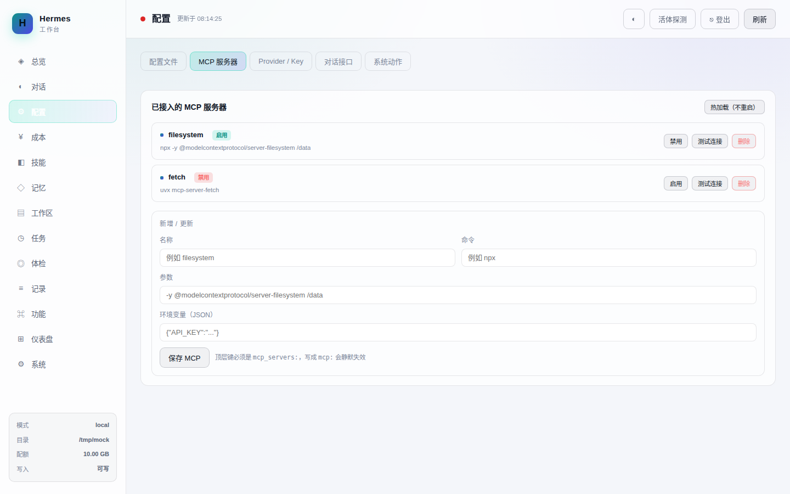

# Hermes Console

**English** | [简体中文](README.zh-CN.md)

> A web console for [Hermes Agent](https://github.com/NousResearch/hermes-agent) — **monitor, chat, configure, track cost, alert, and upgrade** from one panel.


Plain Flask + hand-drawn Canvas. **No frontend build, no chart library, no `node_modules`.**
3 pip dependencies. 43 API endpoints. 13 views. 12 alert channels. 29 smoke tests + CI.

---

## Screenshots

| Overview | Chat |
|:---:|:---:|
|  |  |

| Cost | Config |
|:---:|:---:|
|  |  |

| Workspace | MCP |
|:---:|:---:|
|  |  |

---

## Why

You run an AI agent on a NAS or a home server. It runs fine for weeks — then one day it doesn't, and you find out three days later.

Hermes Console answers two questions you actually care about:

- **Is it still alive?** — not just "is the process running", but "can it still write memory and reach the model"
- **Is it worth feeding?** — token spend, per-model breakdown, budget alerts

And it lets you fix things from a browser instead of SSH-ing into the box at 1am.

## Features

| View | What it does | Why you'd care |
|---|---|---|
| **Overview** | 6 status cards + 60-minute trend + resource bars + recent errors | One glance: is today normal? |
| **Chat** | Talk to your agent from the browser. **Streaming (SSE)** token-by-token, with tool-call cards | No SSH just to give it an instruction |
| **Config** | Edit `config.yaml` / `.env` / `SOUL.md` / skills / cron in-browser | Stop hand-editing YAML over SSH |
| **Cost** | Token + spend by day/week/month, per-model breakdown, budget alerts | Monitoring tells you it broke. Cost tells you whether to keep it. |
| **Alerts** | 12 channels, schema-driven forms, per-channel test button | Find out it died, don't discover it |
| **Skills / Memory** | List, disable, restore, archive, install from Hub | Bloat is the quietest way agents degrade |
| **Cron** | Toggle scheduled jobs (renames to `.disabled`, never deletes) | Attackers love crontab |
| **Audit** | Who changed what, when, from where, old → new | The confidence to let a web UI edit config |
| **Health / Security** | Run your existing check scripts, raw output | Reuse what you already have |
| **Dashboard** | Embeds the **official Hermes web dashboard** (19 pages) via an authenticated proxy | Sessions, files, logs, analytics, profiles, channels — and it gets better as upstream ships |
| **Functions** | Command deck for Hermes: `doctor` / `update` / `memory` / `curator` / `session` / `skills` / `mcp` / `tools` / `model` / `profile`, whitelist-gated | Anything the CLI can do, from a browser |
| **System** | Version + upstream diff, **one-click upgrade for Hermes and for the console itself**, run `doctor`, change your password | Stop hand-running git and update commands |
| **Workspace** | Browse the whole Hermes data dir as a file tree; read/write any text file with auto-backup + validation + path-traversal guard | See and edit everything, not just whitelisted config |

### Three-tier liveness probe

"Process exists" ≠ "can do work". This is the part most dashboards get wrong:

- **L1 Process** — does `hermes --version` answer? (proves it hasn't crashed)
- **L2 Writable** — can it actually write to its memory dir? **Silent write failure is the nastiest fault class**, because every bit of tuning you did evaporates
- **L3 Model** — run a real round-trip (costs tokens)

Default button runs L1+L2 (free). **Shift-click** for L3. Don't put L3 on a cron — that's donating money to your model provider every minute.

### Cost & budget

Daily / 7-day / 30-day tokens and spend, per-model, with a 30-day bar chart.

Two data paths: auto-scan `usage` fields in logs and session files, or POST to `/api/cost/record`. **When there's no data it says so — it never invents numbers.**

Set `BUDGET_DAILY` / `BUDGET_MONTHLY`; warn at 80%, alert at 100%. Alerts fire **only on anomalies**, and the same class of alert is suppressed for 6 hours — otherwise "quota at 91%" becomes one message per minute and you mute it within two hours.

### 12 alert channels

Generic Webhook · WeCom · DingTalk · Telegram · Email (SMTP) · Feishu/Lark (with signing) · Slack · Bark · PushPlus · ServerChan · Gotify · Custom Webhook (GET/POST + template)

All built on the Python standard library. **Adding a channel = a backend block + a schema entry, zero frontend changes.** Credentials are masked in the UI and preserved by index on save — opening the config page and hitting save will **not** overwrite your keys with bullets.

---

## Quick Start

```bash
git clone https://github.com/136772/hermes-console.git
cd hermes-console
./install.sh
```

The script auto-detects your OS (Debian / CentOS / Alpine / macOS / FNOS NAS), architecture, and configures regional mirrors where needed. Three deploy modes to pick from. Every prompt has a default — just hit Enter.

Non-interactive:

```bash
./install.sh --action install --mode docker --yes
```

Or one line:

```bash
curl -fsSL https://raw.githubusercontent.com/136772/hermes-console/main/install.sh | bash
```

### install.sh options

| Flag | What it does | Default |
|---|---|---|
| `--action` | `install` console only · **`hermes+dash` install Hermes + console together** · `update` console only | asks |
| `--mode` | `docker` · `host` · `systemd` (host + autostart) | asks |
| `--hermes-dir PATH` | Hermes data dir **on the host** (always mounted to `/opt/data` in-container) | `/opt/hermes/data` |
| `--port` | Console port | `8080` |
| `--uid` | Run-as UID (match Hermes's) | `1001` |
| `--quota MB` | Quota, drives percentage + alerts | `10240` |
| `--container NAME` | Hermes container name | `hermes` |
| `--danger-token` | Token required for restart/upgrade | **auto-generated** |
| `--budget-daily` / `--budget-monthly` | Budgets (CNY) | `0` (off) |
| `--tz` | Timezone | `Asia/Shanghai` |
| `--repo OWNER/REPO` | Repo to diff against for self-update | empty |
| `--cn-mirror` / `--no-cn-mirror` | Force regional mirrors on/off | auto-detect |
| `-y`, `--yes` | Skip all prompts | off |

```bash
./install.sh                                       # interactive (recommended first run)
./install.sh --action hermes+dash --mode docker    # fresh machine: Hermes + console
./install.sh --mode host --hermes-dir /data/hermes --port 9000
./install.sh --action update                       # update the console only
```

> `--action hermes+dash` is for a **fresh machine** — it installs Hermes itself plus the console.
> If Hermes is already running, use `--action install`: it only adds the console and doesn't touch your existing Hermes.

### Manual

```bash
pip install -r requirements.txt

export HERMES_DIR=/path/to/hermes/data
export HERMES_MODE=docker      # or local
export HERMES_CONTAINER=hermes
export QUOTA_MB=10240

python app.py                  # → http://localhost:8080
```

First password is written to `$HERMES_DIR/DASHBOARD_PASSWORD.txt`.

Docker:

```bash
docker compose up -d --build
```

### Deployment modes

| Mode | How | Trade-off |
|---|---|---|
| **A. Host** (recommended) | Run on the NAS host, use the host's `docker` CLI | Simple, **no `docker.sock` mount needed** |
| **B. Container** | `docker compose up` | Needs `docker.sock` for chat — that's a container-escape surface |
| **C. Read-only** | No docker at all | Monitoring only. Safest, and honestly enough if you just want "tell me if it dies" |

### Auto-start

Don't skip this — a monitor that dies on NAS reboot is worse than no monitor.

```bash
# watchdog (30s keepalive)
./start-dash.sh --daemon
# crontab: @reboot /your/path/hermes-console/start-dash.sh --daemon

# or systemd
sudo cp hermes-console.service /etc/systemd/system/
sudo systemctl daemon-reload && sudo systemctl enable --now hermes-console
```

Container mode already has `restart: unless-stopped`.

---

## Configuration

| Variable | Default | Notes |
|---|---|---|
| `HERMES_DIR` | `/opt/data` | Hermes data directory |
| `HERMES_MODE` | `auto` | `docker` / `local` / `auto` (scans `docker ps` for a hermes container) |
| `HERMES_CONTAINER` | `hermes` | Container name in docker mode |
| `QUOTA_MB` | `10240` | Your quota — drives percentage and alerts |
| `PORT` | `8080` | Listen port |
| `CHAT_TIMEOUT` | `180` | Raise to 300 for complex tasks |
| **`DASH_READ_ONLY`** | `0` | `1` = config center is view-only |
| **`DASH_DANGER_TOKEN`** | empty | Required for restart/upgrade. **Set this.** |
| **`BUDGET_DAILY`** / **`BUDGET_MONTHLY`** | `0` | In CNY, `0` = unlimited |
| `ALERT_INTERVAL` | `600` | Alert check interval (seconds) |
| **`DASH_AUTH`** | `1` | `0` disables login (isolated LAN only) |
| `SESSION_HOURS` | `24` | Session lifetime |
| `HERMES_API` | `http://127.0.0.1:9119` | Official dashboard backend (for the embedded view) |
| `PROXY_TIMEOUT` | `300` | Proxy timeout (seconds) |

Full list in [README.zh-CN.md](README.zh-CN.md#八环境变量).

---

## Security — please read

The console is read-only by default (it only runs `du` / `find` and reads `/proc`). Three things change that, and **all three require you to click**:

1. **Web chat** is equivalent to typing `hermes run "..."` in a shell. Anything Hermes can do, this can do. **Never expose it to the public internet.** LAN / Tailscale / reverse proxy with strong auth only.
2. **The data directory must be mounted `rw`** for the config editor. If you only need monitoring, keep `:ro` and set `DASH_READ_ONLY=1`.
3. **`docker.sock`** (container mode only) is a container-escape surface — socket access is host root. Don't mount it unless you accept that.

> **The panel's permissions = Hermes's permissions.** Don't give it more, and don't put it somewhere more exposed.

Four guardrails on every config write: path whitelist + traversal rejection, syntax validation before write (invalid YAML **never lands on disk**), automatic backup (30 per file) with one-click rollback, and full audit logging.

### Authentication (on by default)

Single password, no username. A random initial password is generated to `DASHBOARD_PASSWORD.txt`, and **first login forces a change**. Stored as **PBKDF2-HMAC-SHA256, 200k iterations**, salted. httpOnly signed session cookies. **5 wrong attempts in 15 minutes → 15-minute lockout.**

---

## Embedded official dashboard

Hermes ships its own web dashboard (FastAPI + React, 19 pages). This console proxies it at `/proxy/<path>` and embeds it in an iframe.

- **Plain HTTP** (status, config, assets, the `ws-ticket` endpoint) goes through this console's `/proxy/` layer and **inherits this console's login auth** (401 if not logged in) — never exposed raw.
- **WebSocket** (the dashboard's live chat + terminal) is terminated by the **Caddy front reverse proxy** and forwarded straight to the upstream `HERMES_API`. Flask is WSGI and can't speak WebSocket, so the upgrade is handled before it reaches the app. Auth on the WS path relies on the upstream's own `ws-ticket` (the iframe fetches a ticket over HTTP first, then opens the socket).

```bash
hermes dashboard --port 9119
```

| Deploy | `HERMES_API` |
|---|---|
| Host | `http://127.0.0.1:9119` |
| Container | `http://172.17.0.1:9119` (docker0) |
| Shared network | `http://hermes:9119` |

---

## API

43 endpoints (plus `/` and the `/proxy/<path>` layer). Highlights:

| Path | Method | Notes |
|---|---|---|
| `/api/overview` | GET | Full snapshot + 60-point history |
| `/api/probe` | GET/POST | Liveness probe, `{"deep":true}` for L3 |
| `/api/chat` | POST | Send a message |
| `/api/chat/stream` | POST | Streaming chat (SSE) |
| `/proxy/<path>` | ANY | Proxies the official dashboard (HTTP inherits console auth; WebSocket upgrade handled by the Caddy front proxy) |
| `/api/cost` | GET | Usage + budget report |
| `/api/cost/record` | POST | Manual usage report |
| `/api/notify` | GET/POST | Alert channels (GET returns schema) |
| `/api/file` | GET/POST | Read/write config (backup + validation) |
| `/api/workspace` | GET | List a directory in the Hermes data dir (the workspace tree) |
| `/api/workspace/file` | GET/POST | Read / write any text file in the workspace (backup + validation) |
| `/api/mcp` | GET/POST | List / save MCP servers (config.yaml `mcp_servers`, comment-preserving) |
| `/api/mcp/test` | POST | Connectivity test for one MCP server (`hermes mcp test <name>`) |
| `/api/rollback` | POST | Rollback (snapshots current state first) |
| `/api/mcp` | GET/POST | MCP servers |
| `/api/audit` | GET | Change audit (last 120) |

Full table in [README.zh-CN.md](README.zh-CN.md#十五api).

---

## Contributing

PRs welcome — see [CONTRIBUTING.md](CONTRIBUTING.md). Bug reports and feature requests via [Issues](https://github.com/136772/hermes-console/issues).

If this saved you an SSH session, a ⭐ costs nothing and helps a lot.

## License

MIT
